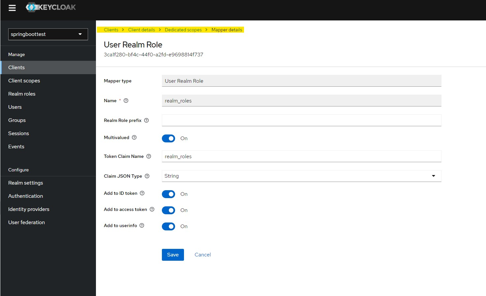

# Session-based Keycloak with Spring boot 3
<br>

> Requirements: 
* keycloak (you can use docker)
* Java 17+
* Maven

<br>
<br>

1. If you have docker, you can run:
<br>

```bash
docker run -p 8080:8080 -e KEYCLOAK_ADMIN=admin -e KEYCLOAK_ADMIN_PASSWORD=admin quay.io/keycloak/keycloak:20.0.2 start-dev
```

<br>
<br>

2. Open http://localhost:8080 with:

| User | Pass |
|---|---|
| admin | admin |

<br>
<br>

3. Create a realm and a client, check the [src/main/resources/application.properties](./src/main/resources/application.properties) file, to show the default properties, you can change to your preferences.

The configuration default is shown below:

<br>


1. 
2. 
3. 
4. 

<br>

### Important
> It is necessary to add a mapper of the user roles, that way Spring security will be able to form the authorities correctly.
Example: [src/main/java/dev/eduardova/secexample/configs/securityConfig.java](./src/main/java/dev/eduardova/secexample/configs/securityConfig.java#L58)

5. 

A role has been created in the realm called "admin" and attached to a user (with set credentials), screenshots are skipped as no special configuration has been done.

<br>

4. Runs app with maven goal: `mvn spring-boot:run`

<br>

* The `/` endpoint is not restricted.
* The `/home` endpoint is allowed only for the `admin` role.
  * If you try to enter a protected page, you will be redirected to keycloak login page
* Log out, also destroy the session in keycloak.
